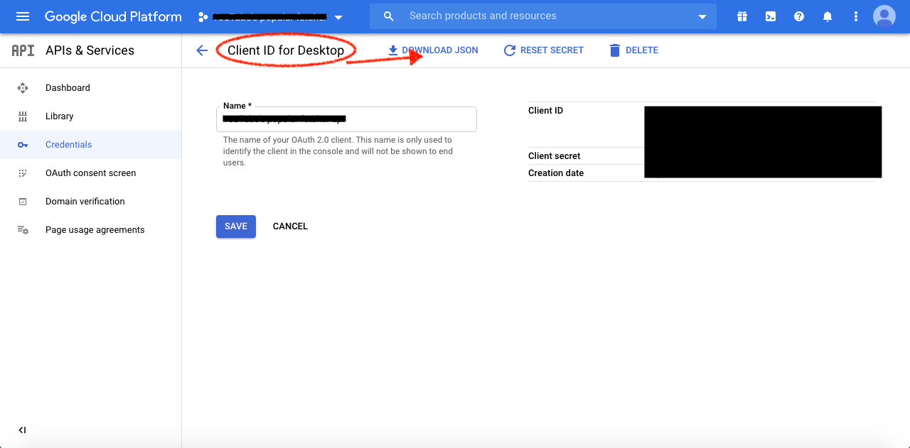

# YouTube's Popular Fetcher

Fetching popular content via YouTube API v3.

## Requirements

 - Python 3.7
 - Docker (optional)
 - GCP account and project, [accessing](https://console.cloud.google.com/home/dashboard).
 - Google's credential for YouTube API

## Project Structure

```
popular-fetcher
|- apis
|  `- ANY_API                 
|- token
|  |- client_secret.json      # Google's credential for YouTube API
|  `- storage.dat             # Keep access token in authorized process
|- build.sh                   # Build Docker container image
|- Dockerfile
|- requirements.txt           # Dependency list
|- run.sh                     # Endtrypoint to start service in the container
|- run_via_docker.sh          # Run the container image
`- server.py                  # Main service
```

## Preparing Environment

### Install YouTube API to GCP
Before creating the credential, you need to install YouTube API v3 to your project first.

### Create Credential

To create credential, you must select `Application type` to be **"Desktop app"**. Let's [create it](https://console.cloud.google.com/apis/credentials).



After created, you should download it into `~/popular-fetcher/token/` and renamed it to **"client_secret.json"**

### Install Dependencies

```bash
$ pip3 install -r requirements.txt
```

## Start service

### Undockerize

```bash
$ python3 server.py
```

### Dockerize

Does NOT support yet!!!